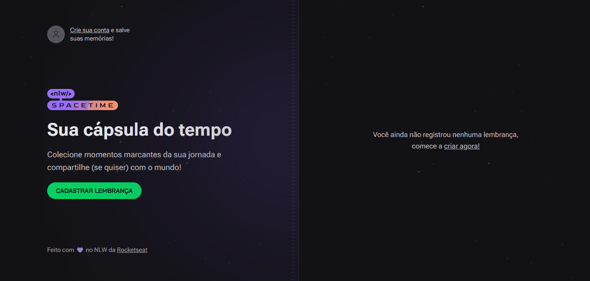

# NLW SpaceTime




Projeto desenvolvido durante a NLW (Next Level Week) da Rocketseat. Esta foi a 12ª edição. O projeto trata-se de uma cápsula do tempo, onde você possa registrar suas lembranças mais importantes da vida.

## 🚀 Tecnologias

- Next.js 13
- React
- Next Auth
- TailwindCSS
- Expo 
- TypeScript
- Node.js
- [Fastify](https://www.fastify.io/)
- [Node e NPM](https://nodejs.org/)

## Instalação


```terminal
$ git clone https://github.com/filipedev6/nlw-spacetime.git

$ cd nlw-spacetime
```

### Server
```terminal
$ cd server

$ npm install
```

```terminal
# Github (Web)
- GITHUB_CLIENT_ID=YOUR_WEB_CLIENT_ID
- GITHUB_CLIENT_SECRET=YOUR_WEB_CLIENT_SECRET

# Github (Mobile)
- GITHUB_CLIENT_ID=YOUR_MOBILE_CLIENT_ID
- GITHUB_CLIENT_SECRET=YOUR_MOBILE_CLIENT_SECRET
```

```terminal
$ npm run dev
```

### Web
```terminal
$ cd web

$ npm install
```

```terminal
- NEXT_PUBLIC_GITHUB_CLIENT_ID=YOUR_WEB_CLIENT_ID
```

```terminal
$ npm run dev
```

### Mobile
```terminal
$ cd mobile

$ npm install

$ npm run start
```

